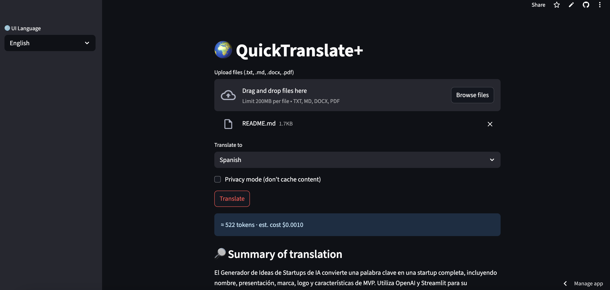

# 🌍 QuickTranslate+

---

QuickTranslate+ is a free, lightweight language translation tool built with Streamlit and OpenAI.  
Upload a `.txt`, `.md`, `.docx`, or `.pdf` file — choose a language — and get a translated version instantly.

---

## 🚀 Features

- 🗂 Upload multiple file types: `.txt`, `.md`, `.docx`, `.pdf`
- 🌐 Translate into 11+ major languages
- 📉 Token count + estimated OpenAI cost before translating
- 🔄 Chunking support for long documents (auto-splits)
- 🧠 Auto-detect source language
- 🧾 Output as `.txt`, `.md`, or `.docx`
- 🔒 Privacy Mode (no caching or local storage)
- 🔎 Translated summary included
- 🧳 Multi-file support with `.zip` download

---

## 📸 Screenshot

---

## 🧪 Try It Now

👉 [Launch on Streamlit Cloud](https://quicktranslate-plus-9rggbnyyakqxmdgbcrwwvw.streamlit.app/)

---

## 🛠 Tech Stack

- [Streamlit](https://streamlit.io)
- [OpenAI GPT-3.5 / GPT-4o](https://platform.openai.com/docs)
- [python-docx](https://github.com/python-openxml/python-docx)
- [PyPDF2](https://pypi.org/project/PyPDF2/)
- [langdetect](https://pypi.org/project/langdetect/)
- [tiktoken](https://github.com/openai/tiktoken)

---

## 📂 Project Status

✅ MVP complete and deployed  
🧩 Additional features coming soon:
- Export to PDF
- UI themes
- Glossary term overrides

---

## 🧑‍💻 Author

Built by [Michael Hastings](https://github.com/haystackz12)  
Part of the **90 Apps in 90 Days** portfolio project.
